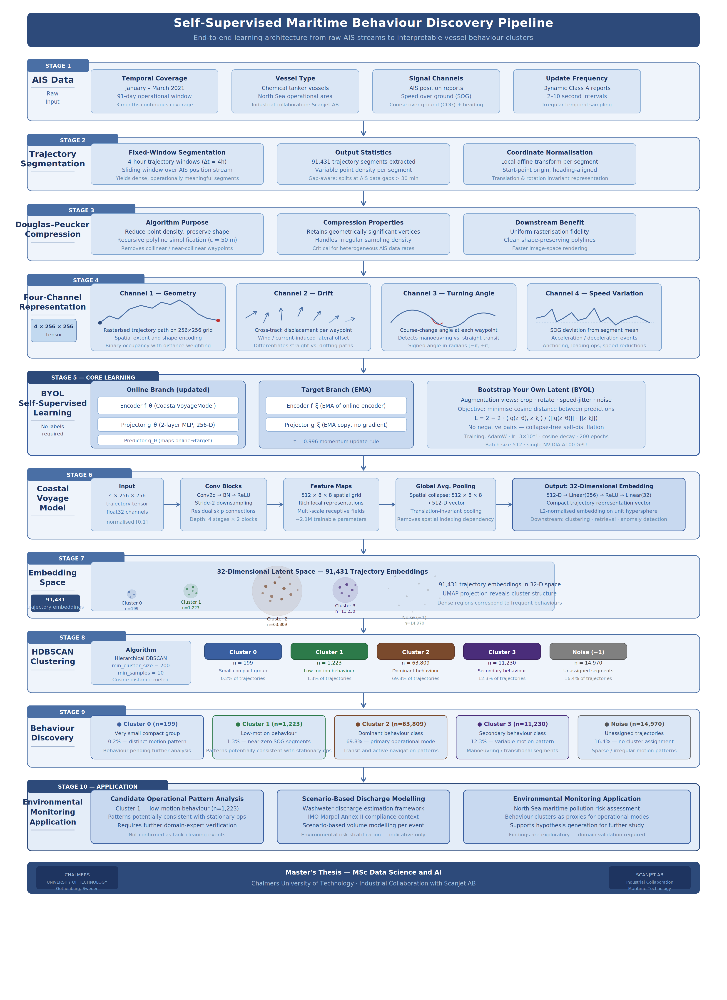
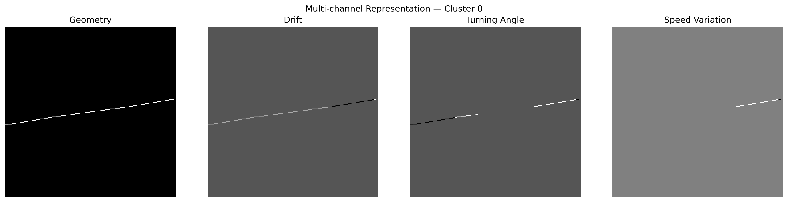
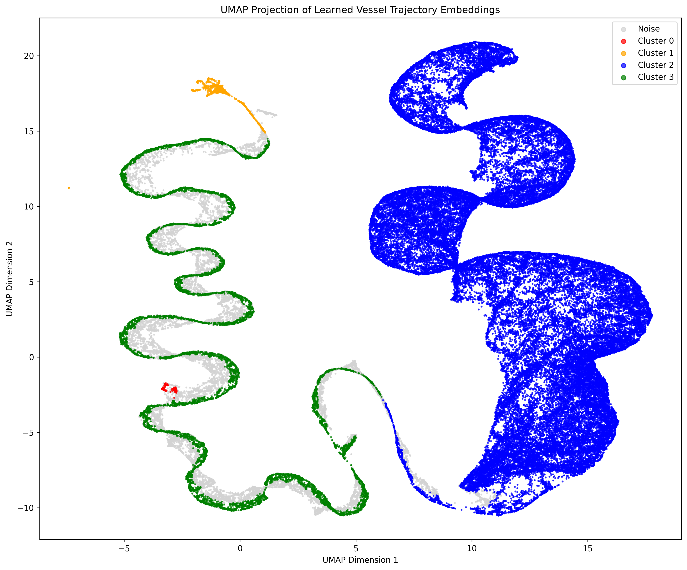
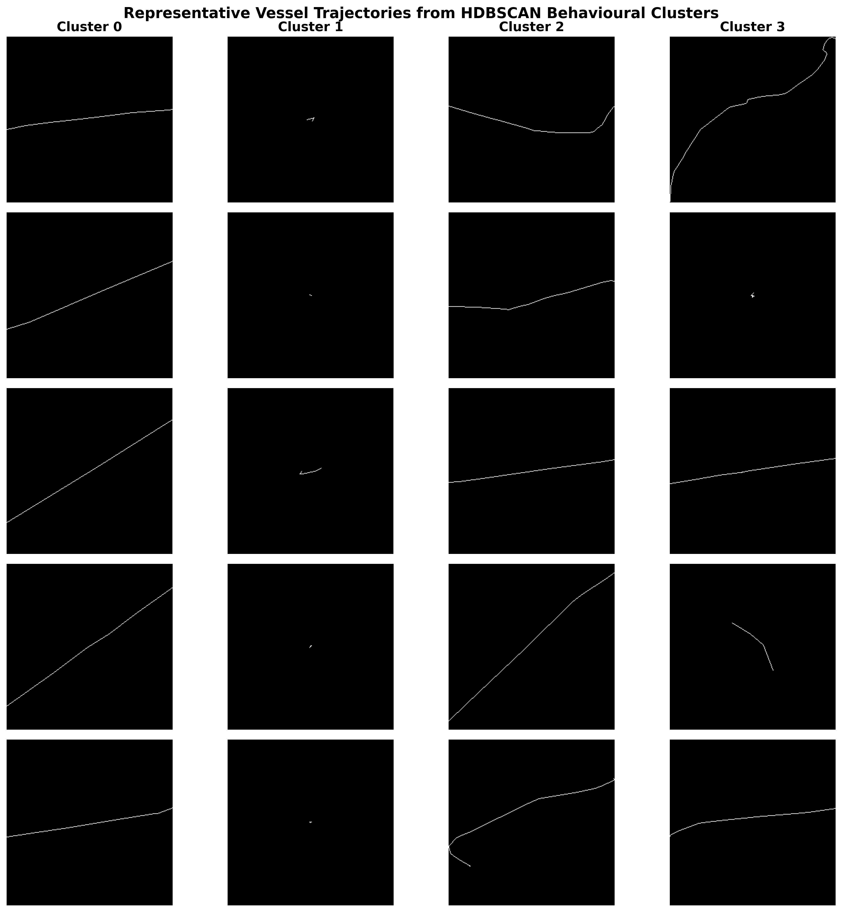

# Self-Supervised Maritime Behaviour Discovery

**AI/ML Applications to Identify Tank Cleaning Operations & Quantify Slop Discharge**

Master's Thesis Project — MSc Data Science and AI
Chalmers University of Technology
Industrial Collaboration with Scanjet AB

## Overview

This project investigates the use of self-supervised deep learning for maritime behaviour discovery from Automatic Identification System (AIS) vessel trajectories. The objective is to automatically identify behavioural patterns associated with tank-cleaning operations and potential slop discharge events without relying on manually labelled data.

The proposed pipeline transforms vessel trajectories into multi-channel image representations and learns latent behavioural embeddings using Bootstrap Your Own Latent (BYOL), a self-supervised representation learning framework. The learned embeddings are subsequently clustered using HDBSCAN to discover distinct operational behaviours present in large-scale AIS datasets.

The study was conducted on AIS data collected during January–March 2021 and includes 91,431 vessel trajectories. The resulting workflow enables unsupervised discovery of maritime behavioural patterns and provides a scalable framework for environmental monitoring and maritime intelligence applications.

## Key Contributions

* Construction of a maritime trajectory processing pipeline from raw AIS data.
* Generation of multi-channel trajectory representations suitable for deep learning.
* Self-supervised representation learning using BYOL.
* Behaviour discovery using HDBSCAN clustering.
* Visualization of latent behavioural structure using UMAP.
* Identification of operational patterns potentially related to tank-cleaning activities and slop discharge events.
  
## Methodology Overview



## Dataset

* Source: AIS vessel trajectory data
* Time period: January–March 2021
* Number of trajectories: 91,431
* Domain: Maritime vessel behaviour analysis
* Industrial partner: Scanjet AB


## Trajectory Representation

Each AIS trajectory segment is transformed into a four-channel image representation before self-supervised learning.

| Channel | Description |
|----------|-------------|
| Geometry | Rasterized vessel trajectory path |
| Drift | Difference between course-over-ground and heading |
| Turning Angle | Change in course-over-ground between consecutive AIS messages |
| Speed Variation | Change in speed-over-ground between consecutive AIS messages |




## Results

The learned latent representations successfully separate distinct behavioural patterns within the AIS dataset. HDBSCAN clustering identified several major behavioural groups as well as anomalous trajectories.

### Experimental Summary

| Item | Value |
|--------|--------|
| AIS Trajectories | 91,431 |
| Representation | 4-Channel Trajectory Images |
| Learning Method | BYOL |
| Embedding Dimension | 32 |
| Clusters Discovered | 4 |
| Noise Fraction | 16.4% |
| Clustering Method | HDBSCAN |
| Visualization Method | UMAP |

Cluster distribution:

| Cluster    | Samples |
| ---------- | ------: |
| -1 (Noise) |  14,970 |
| 0          |     199 |
| 1          |   1,223 |
| 2          |  63,809 |
| 3          |  11,230 |

UMAP visualization of the learned embedding space:



Representative trajectories from the discovered behavioural clusters:



### Behavioural Interpretation

- **Cluster 2 (63,809 trajectories):** Dominant transit behaviour characterized by relatively stable navigation patterns.

- **Cluster 3 (11,230 trajectories):** More variable manoeuvring behaviour with increased trajectory curvature.

- **Cluster 1 (1,223 trajectories):** Low-motion operational segments potentially consistent with stationary or near-stationary activities.

- **Cluster 0 (199 trajectories):** Rare behavioural patterns requiring further investigation.

- **Noise (-1):** Trajectories not confidently assigned to any behavioural cluster.

## Repository Structure

```text
analysis/        Jupyter notebooks and cluster analysis
configs/         Training and inference configurations
datasets/        Dataset implementations
helpers/         Configuration and utility functions
models/          Neural network architectures
plots/           Figures used in analysis and documentation
scripts/         Dataset construction utilities
src/             AIS processing and feature engineering pipeline
exported/        32-D trajectory embeddings and HDBSCAN cluster assignments
```

## Pipeline

AIS Trajectories
→ Feature Engineering
→ Multi-Channel Image Generation
→ BYOL Representation Learning
→ Embedding Extraction
→ HDBSCAN Clustering
→ UMAP Visualization
→ Behaviour Discovery

## Technologies

* Python
* PyTorch
* BYOL
* HDBSCAN
* UMAP
* NumPy
* Pandas
* Scikit-Learn
* Matplotlib
* HDF5

## Reproducing the Pipeline

### 1. Build AIS Trajectory Dataset

```bash
bash run_build_dataset.sh
```

### 2. Apply Trajectory Compression

```bash
bash run_compress_dataset.sh
```

### 3. Generate HDF5 Trajectory Representations

```bash
bash run_hdf5_generation.sh
```

### 4. Train the Self-Supervised Model

```bash
bash run_train_model.sh
```

### 5. Generate Embeddings and Cluster Assignments

```bash
bash run_inference.sh
```

## Disclaimer

The original AIS data and trained models are not included in this repository due to size and data-sharing restrictions. The repository contains the complete processing, training, inference, and analysis pipeline required to reproduce the methodology.
